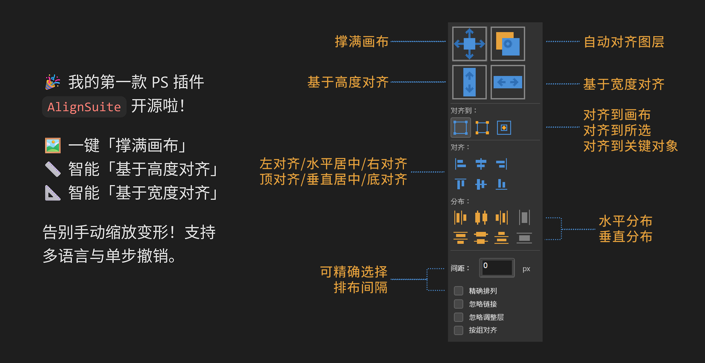
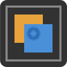

# AlignSuite for Photoshop

      

**AlignSuite**是一款专业高效的 Adobe Photoshop 扩展工具，采用 UXP 技术构建。面板体积小巧，旨在通过强大的对齐、分布和智能缩放功能，大幅提升您的排版与图层管理效率。

## ✨ 核心亮点：顶部四大功能

这四个按钮位于面板最上方，提供最常用的智能图层处理功能：
| 功能 | 截图 | 说明 |
| --- | --- | --- |
| 撑满画布 |  | 自动缩放选中图层，使其完全覆盖整个画布。 |
| 自动对齐图层 |  | 直接调用 Photoshop 原生的“自动对齐图层”功能，智能识别图层内容并进行无缝对齐。 |
| 基于高度对齐 |  | 锁定纵横比，将选中图层缩放至画布高度并居中。 |
| 基于宽度对齐 |  | 锁定纵横比，将选中图层缩放至画布宽度并居中 |

## 📊 对齐与分布

面板中部提供了专业且全面的对齐控制。您可以先选择**对齐到**的目标（画布、所选区域、关键对象），然后执行以下操作：

*   **6种对齐方式**：左对齐、水平居中、右对齐、顶对齐、垂直居中、底对齐。
*   **6种分布方式**：按左分布、水平分布、按右分布、按顶分布、垂直分布、按底分布。

## ⚙️ 高级选项与勾选项

底部的勾选项让工具能适应各种复杂的图层结构：

*   **精确排列** ：勾选后，底部将启用“水平/垂直排列”按钮，支持按自定义“间距”数值进行精确排列。
*   **忽略链接** ：操作时自动断开关联图层的链接，防止联动移动。
*   **忽略调整层** ：将调整图层（如曲线、色阶）排除在对齐操作之外。
*   **按组对齐** ：将组视为单个整体进行对齐，而不是展开组内的所有子图层。

## 🌍 多语言支持

插件 UI 内置中、英、日、韩四国语言，自动匹配您当前 Photoshop 的界面语言。

## 📦 安装与使用

1. 下载本仓库中最新版本的 `.ccx` 安装包 (`AlignSuite.v1.0.1.ccx`)。
2. 双击该文件，或通过 Adobe Creative Cloud 桌面端进行安装。
3. 在 Photoshop 中打开任意文档，通过顶部菜单 `增效工具 (Plugins) -> AlignSuite` 打开面板即可使用。

---
*代码完全由 [DeepSeek](https://chat.deepseek.com/) 完成*
