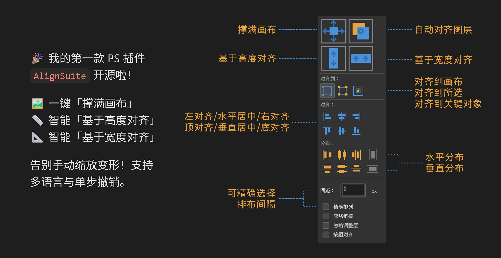
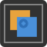

# AlignSuite for Photoshop

<a href="https://github.com/zbt00123/AlignSuite">简体中文</a> | English

      

**AlignSuite** is a professional and efficient Adobe Photoshop extension tool built with UXP technology. The panel is compact and designed to greatly improve your layout and layer management efficiency through powerful alignment, distribution, and smart scaling features.

## 🚀 Download

Download link 1: [Adobe Creative Cloud](https://adobe.com/go/cc_plugins_discover_plugin?pluginId=4005361a&workflow=share)  
Download link 2: [Release page](https://github.com/zbt00123/AlignSuite/releases)

## ✨ Core Highlights: Top Four Functions

These four buttons are located at the top of the panel and provide the most commonly used smart layer processing functions:
| Function | Screenshot | Description |
| --- | --- | --- |
| Fill Canvas |  | Automatically scales the selected layer so that it completely covers the entire canvas. |
| Auto-Align Layers |  | Directly invokes Photoshop's native "Auto-Align Layers" feature, intelligently recognizing layer content and performing seamless alignment. |
| Align by Height |  | Locks the aspect ratio, scales the selected layer to the canvas height, and centers it. |
| Align by Width |  | Locks the aspect ratio, scales the selected layer to the canvas width, and centers it |

## 📊 Alignment and Distribution

The middle of the panel provides professional and comprehensive alignment controls. You can first choose the **Align To** target (Canvas, Selection, Key Object), and then perform the following operations:

*   **6 alignment methods**: Align Left, Align Horizontal Centers, Align Right, Align Top, Align Vertical Centers, Align Bottom.
*   **6 distribution methods**: Distribute by Left, Distribute Horizontally, Distribute by Right, Distribute by Top, Distribute Vertically, Distribute by Bottom.

## ⚙️ Advanced Options and Checkboxes

The checkboxes at the bottom allow the tool to adapt to various complex layer structures:

*   **Precise Arrangement**: When checked, the "Horizontal/Vertical Arrange" buttons at the bottom will be enabled, supporting precise arrangement by a custom "Spacing" value.
*   **Ignore Links**: Automatically breaks the links of linked layers during operations to prevent linked movement.
*   **Ignore Adjustment Layers**: Excludes adjustment layers (such as Curves and Levels) from alignment operations.
*   **Align by Group**: Treats groups as a single whole for alignment, instead of expanding all sub-layers within the group.

## 🌍 Multilingual Support

The plugin UI has built-in Chinese, English, Japanese, and Korean languages, and automatically matches your current Photoshop interface language.

## 📦 Installation and Usage

1. Download the latest `.ccx` installation package (`AlignSuite.v1.0.1.ccx`) from this repository.
2. Double-click the file, or install it through the Adobe Creative Cloud desktop app.
3. Open any document in Photoshop, then use the top menu `Plugins -> AlignSuite` to open the panel and start using it.

---
*Code is entirely completed by [DeepSeek](https://chat.deepseek.com/)*
